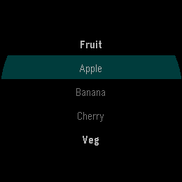

# pebble-signals

**Fine-grained reactive UI for Pebble watches — Solid-style signals + JSX, no
VDOM — running ON the watch inside its 32 KB JavaScript heap.**

> **Status: pre-1.0 (`0.1.0`), single maintainer.** Every number and screenshot
> below is measured or captured on the SDK 4.17 **QEMU emulators** — gabbro
> (Pebble Round 2, round 260×260) and emery (Pebble Time 2, rect 200×228).
> There are no hardware receipts yet, and we would rather say so than imply
> them. APIs can still move before 1.0; nothing gets deleted without a relabel
> first.

You write TypeScript + JSX with components, `useState` and live bindings; the
build lowers it to real Piu nodes and a live signal graph that ships with the
app. This is (as far as we know) the first **runtime**-reactive UI on this
hardware — [react-pebble] resolves reactivity at compile time in Node and emits
static Piu, so runtime-dynamic trees (lists that change shape, data-driven UI)
are ours and not theirs.

## The killer facts

- **No virtual DOM.** The UI tree is built **once**. An update is one effect run
  and one Piu property assignment, driven by the single signal that changed —
  there is no diff, no tree walk, no re-render pass.
- **Components run once.** A component function executes a single time to build
  Piu nodes. That is why state works at module scope, in a component, anywhere.
  Read it by **calling** the getter — `count()`, not `count`.
- **Reactive props are thunks** — `string={() => "c" + count()}` — and the build
  auto-wraps bare reactive reads for you.
- **The budgets are the design.** The XS arena is firmware-fixed and it is the
  scarce resource; every API here is shaped by the four numbers below.

### Measured budgets (SDK 4.17, QEMU)

| Budget | Number | What blowing it looks like |
|---|---|---|
| JS heap ("arena") | 32 KB total, **26,624 B usable** (slots + chunk) | `fxAbort memory full` — the firmware reboots to the launcher |
| Boot symbol floor | **~150 archive symbols** (richlist boots at 149) | dies AT BOOT, silently, with no visible error |
| XS value stack | **384 slots / 6,144 B** (a `Navigator` face peaked at 383) | `fxAbort JavaScript stack overflow` |
| Native app heap ("archive edge") | **116,816 B boots / 117,042 B dies** — and it moves with the app | install-time refusal / launch reboot |

Budget **symbols and top-level bindings**, not archive kilobytes: a 24.6 KB
archive with resources boots fine while a 12,304 B probe dies. The full
derivation, the corrections, and the 24 numbered gotchas behind these numbers
are in the [handbook](docs/handbook.md) and the
[XS heap playbook](docs/xs-heap-playbook.md).

## A whole watchface

```tsx
import { render } from "runtime/jsx-runtime";
import { useClock } from "runtime/clock";

const bg = new Skin({ fill: "black" });
const big = new Style({ font: "bold 42px Bitham", color: "white" });
const sub = new Style({ font: "18px Gothic", color: "#AAAAAA" });
const two = (n: number) => (n < 10 ? "0" : "") + n;
const now = useClock("second");          // the native tick service, not setInterval

render(() => (
  <Container left={0} right={0} top={0} bottom={0}>
    <Column>
      <Label style={big} string={() => two(now().getHours()) + ":" + two(now().getMinutes())} />
      <Label style={sub} string={() => two(now().getSeconds())} />
    </Column>
  </Container>
), { skin: bg, style: sub });
```

`Skin`, `Style`, `Container`, `Column` and `Label` are Piu host globals — no
import needed. The two `<Label>`s subscribe to different reads, so the minutes
line repaints once a minute while the seconds line ticks. Layout is fill-based,
so Piu positions it from the actual screen size: the same source renders on both
the round and the rectangular watch with no per-platform code.

## Screenshots

Real `pebble screenshot` / QEMU framebuffer captures, one per example app.

| `pulse` — the flagship | `ultraface` — round-native instrument face |
|---|---|
|  |  |
| custom TTF clock, animated accent dot, persisted themes, a config-page greeting, and a lazily-imported log screen | a 60-segment radial seconds ring + dense complications, all on one `useClock("second")` Canvas |

| `weather` — the phone data channel | `sectionlist` — grouped recycled rows | `qrfull` — largest inscribed square |
|---|---|---|
|  |  |  |
| city / temp / condition driven over the proven `useConfig` AppMessage bridge | headers + rows in one flat index space, each slot a single reused `Label` | on a round panel `fullscreen` means `floor(260/√2)` = 183 px, centered, so the finder patterns survive the bezel |

More, on both watch shapes: [examples gallery](docs/examples.md) ·
[component catalog](docs/components.md).

## Install

```sh
npm install pebble-signals
```

Scaffold a new project (the `create-pebble-signals` CLI ships in the package):

```sh
npx -p pebble-signals create-pebble-signals my-watch
cd my-watch && npm install && npm run build
```

> **Honest caveat:** 0.1.0 publishes to npm alongside this repo's launch. If
> the commands above 404, the publish has not landed yet — the equivalent from
> a checkout is `node tools/create-app.mts my-watch` for the scaffold plus
> `npm pack` here for the tarball to install by path, and
> `pnpm run test:consumer` gates that pack → install → typecheck path on every
> commit. Full exports map, upgrade rules and a worked consumer project:
> [packaging & consuming](docs/packaging.md).

You also need the Pebble tool v5 + SDK 4.17 with the QEMU emulators and Node ≥ 24
— setup steps in [getting started](docs/getting-started.md).

### Or work in this repo

```sh
git clone https://github.com/emindeniz99/pebble-signals
cd pebble-signals
pnpm install
pnpm run dev -- --app watchface   # build + install + live logs, one command
pnpm run verify                   # SDK-free gates: typecheck + tests @100% coverage
```

**Success looks like** a black face with a big HH:MM ticking on the gabbro
emulator while the terminal streams `instruments:` heartbeats about once a
second. Zero heartbeats means a dead log transport, not a quiet app —
[troubleshooting](docs/debugging.md).

## Component catalog

52 components and hooks, each in its own `runtime/<name>` module. They are
**opt-in and zero-cost**: the manifest prunes to your import closure, so an app
that never imports one never ships it. Every entry is 100 %-covered by the Node
suites and verified on-device on both shapes —
**[full catalog with screenshots → `docs/components.md`](docs/components.md)**.

- **Drawing** — `draw` (Canvas + `fillRect`/`fillCircle`/`arc`/`line`/`text`)
- **Widgets** — `badge` · `progressbar` · `slider` · `toggle` · `meter` ·
  `sparkline` · `dots` · `gauge` · `clockface` · `statusbar` · `actionbar` ·
  `card` · `dialog` · `tabs` · `roundsafe`
- **Lists & layout** — `scrollable` · `grid` · `sectionlist`
- **Menus & input** — `menu` · `picker` · `numberfield` · `textflow` ·
  `actionmenu` · `spinner` · `button` · `press` · `backhandler`
- **Media** — `image` · `imagebackground` · `vectorimage` · `qrcode`
- **Time & motion** — `clock` · `timers` · `hosttime` · `anim`
  (`useTween`/`useSequence`/`useSpring`) · `easing`
- **State, storage & lifecycle** — `localstorage` · `kvstore` · `state` ·
  `files` · `lifecycle` (launch reason, focus, wakeup)
- **Connectivity** — `message` · `config` · `phonefetch` · `fetch`
  (device-gated — see gotcha 18a)
- **Sensors & device** — `accel` · `compass` · `battery` · `connection` ·
  `watchinfo` · `vibration`

The reactive core (`runtime/signals`, `runtime/jsx-runtime`, `runtime/flow`) is
preloaded to flash and always present: signals, computeds, effects, ownership,
`Show`, keyed `For`, `VirtualList`, `Navigator`, `Move`, `ErrorBoundary`.

## Agent skill

The depth that makes this library work — measured budgets, 24 gotchas, the valid
font table, the emulator recipes — is a lot for a human to read before their
first watchface, and exactly what an **agent** needs to get a build right on the
first try. That knowledge is packaged as a skill in
[`skills/`](skills/README.md):

```bash
mkdir -p .claude/skills
cp -r node_modules/pebble-signals/skills/pebble-signals-watchface .claude/skills/
```

Then ask your agent for a Pebble watchface with pebble-signals.

## Where to go next

| I want to… | go to |
|---|---|
| the numbered gotchas + the full measured ledger | **[Handbook](docs/handbook.md)** (this page's predecessor) |
| every component, with device screenshots | [Component catalog](docs/components.md) |
| learn it step by step | [Build a watchface](tutorials/build-a-watchface/README.md) (3 parts) → [The complete watchface](tutorials/complete-watchface/README.md) (6 parts) |
| port an existing app | [Migration from C / Rocky / React / classic Piu](docs/migration.md) |
| quick answers | [FAQ](docs/faq.md) |
| understand the model | [Core concepts](docs/concepts.md) · [API parity](docs/api-parity.md) |
| know who this is for and what it competes with | [Market notes](docs/market-notes.md) |
| file an issue or send a patch | [Contributing](CONTRIBUTING.md) — setup, the receipts discipline, the 100 % coverage bar |
| everything else | [All docs](docs/README.md) · [Changelog](CHANGELOG.md) |

## License

MIT — see [`LICENSE`](LICENSE). The Moddable SDK typings vendored under
[`types/moddable/`](types/moddable/) are compile-time-only declarations with
their own provenance and terms, documented in
[`types/moddable/NOTICE.md`](types/moddable/NOTICE.md).

[react-pebble]: https://github.com/eddiemoore/react-pebble
