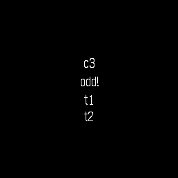

# signal-piu

**Runtime fine-grained reactive UI for Pebble (Alloy / Piu / Moddable XS).**

Solid-style signals + JSX + components — no virtual DOM — rendering to the
Piu scene graph on the new Pebble watches (Time 2 / Round 2). The UI tree is
built **once**; every update is a single Piu property assignment or a minimal
scene-graph edit driven by a signal.

This is (as far as we know) the first **runtime**-reactive UI running on this
hardware. The existing React-like option, [react-pebble], resolves all
reactivity at compile time in Node and emits static Piu code; signal-piu keeps
a live reactive graph on the watch itself, so runtime-dynamic UIs (lists that
change shape, data-driven trees) work without a compile step.

All milestones below were verified on the **gabbro** (Pebble Round 2,
260×260) emulator, SDK 4.17, and the combined demo additionally runs its
full interaction set on **emery** (Pebble Time 2 — `m7-emery.png`). Every
number in this README is measured from XS instrumentation logs or
on-device bisection — none are estimates.



## Quick start

```sh
# prerequisites: pebble tool v5 + SDK 4.17, tsc >= 5.5 on PATH
./build.sh                            # tsc (JSX -> src/embeddedjs/app) + pebble build
pebble install --emulator gabbro
```

Demo controls (buttons, because of an emulator touch bug — see gotcha 2):
**up** = push a record (odd ids are strings `sN`, even ids are int32 `#N`) ·
**down** = remove the first record. The demo (M9) is a dynamic mixed-type
list in a byte pool with a 3-row window — 40+ records with a flat arena.

```sh
npm test          # reactive core + store (real modules) + flow (piu stubs)
npm run test:mem    # on-device memory audit (needs the app installed on the
                    # gabbro emulator and pypkjs killed: pkill -9 -f '[p]ypkjs' —
                    # the [p] stops -f matching YOUR OWN shell's command line)
npm run test:limit  # limit finder / regression canary: adds todo rows until
                    # the arena dies and reports the exact item count
python3 tools/drive.py gabbro b:select s:1 d:shot   # deterministic emu driver
```

## Examples — one app per example (react-pebble style)

Several prebuilt reactive screens in one mod exceed the 32KB arena at
boot (see the multi-screen section), so examples ship as STANDALONE
apps, selected at build time:

```sh
APP=clock ./build.sh && pebble install --emulator gabbro
```

Every app below is verified on BOTH watches — **gabbro** (Round 2, round
260×260) and **emery** (Time 2, square 200×228) — from the SAME source,
with no per-platform code. Layout is fill-based (`left/right/top/bottom
={0}`) plus a centering `Column`, so **Piu's layout engine positions
everything at runtime from the actual screen size** — the round and
square screenshots below come from identical `.tsx`.

| APP | UI | Proves | gabbro (round) | emery (square) |
|-----|----|--------|:---:|:---:|
| `list` (default) | dynamic mixed-type list, 3-row window, PERSISTED | store + windowing + buttons + localStorage | ✅ `ex-list-persisted.png` | ✅ `em-list.png` |
| `clock` | ticking HH:MM:SS watchface + date | `Date`, `setInterval`, Bitham + Gothic styles | ✅ `ex-clock.png` | ✅ `em-clock.png` |
| `counter` | classic up/down counter | `useState` + button handlers | ✅ `ex-counter.png` | ✅ `em-counter.png` |
| `toggle` | ON/OFF with live skin+style flip | reactive `skin`/`style` setProp path | ✅ `ex-toggle-on.png` | ✅ `em-toggle-on.png` |
| `forbind` | 3 reactive `For` rows (gotcha-16 testbed) | reactive bindings INSIDE For rows | ✅ `ex-forbind-boot.png` / `ex-forbind-updated.png` | ✅ `em-forbind.png` |
| `scroll` | **virtualized infinite scroll** via `VirtualList` | windowing + cell recycling + scroll offset | ✅ `scroll-gabbro-*.png` | ✅ `scroll-emery-*.png` |
| `richlist` | **rich recycled rows** (`renderRow`): 2-column row, 1 visible, scrollable | multi-element rows, not just text | ✅ `richlist-gabbro-*.png` | ✅ `richlist-emery-*.png` |
| `multiscreen` | 4 screens in one mod | does NOT boot — kept as the arena-OOM artifact | ❌ by design | ❌ |

The 32KB arena is firmware-fixed and screen-independent: audit floor
83% on gabbro, 84% on emery; the 40-record ramp stays flat on both.
(A `port` example — the immediate-mode escape hatch — also exists but is
not part of the standard set.)

Sources live in `src/tsx/examples/`; `src/tsx/main.tsx` is generated by
build.sh (gitignored). Screen adaptation is Piu's job, not ours: we
never read or hardcode the width/height. Static pixel coordinates (as in
the `port` example) would NOT adapt — that is the cost of leaving Piu's
layout engine.

## What a component looks like

```tsx
import { render } from "runtime/jsx-runtime";
import { useState } from "runtime/signals";
import { Show, For } from "runtime/flow";

const [count, setCount] = useState(0);
const [todos, setTodos] = useState([1, 2]);

render(() => (
  <Container left={0} right={0} top={0} bottom={0} focus={true}
    onPressSelect={() => setCount(c => c + 1)}>
    <Column>
      <Label string={() => "c" + count()} />           {/* live binding */}
      <Show keepAlive={true} when={() => count() % 2 === 1}
        width={120} height={30}
        fallback={() => <Label string="even" />}>   {/* sides auto-wrapped */}
        {() => <Label string="odd!" />}
      </Show>
      <For each={() => todos()} key={id => id} width={120}>
        {id => <Label string={"t" + id} />}            {/* per-row component */}
      </For>
    </Column>
  </Container>
), { skin: new Skin({ fill: "black" }), style: new Style({ font: "24px Gothic", color: "white" }) });
```

## Three differences from React

1. **Components run once.** There is no re-render. A component function
   executes a single time to build real Piu nodes; updates flow through
   signals into individual property writes.
2. **Read state by calling the getter**: `count()`, not `count`. `useState`
   returns `[getter, setter]`.
3. **Pass reactive values as thunks and don't destructure reactive props.**
   `string={() => "c" + count()}` creates a live binding;
   `string={"c" + count()}` bakes in the value at build time forever.

## Architecture

```
src/tsx/*.tsx            app code (JSX) — transpiled by plain tsc
src/embeddedjs/
  manifest.json          Moddable mod manifest (maps modules, PRELOADS runtime)
  runtime/signals.js     signals + ownership + hooks   (preloaded to flash)
  runtime/jsx-runtime.js JSX factory -> real Piu nodes (preloaded to flash)
  runtime/flow.js        Show / For control flow       (preloaded to flash)
  app/*.js               generated from src/tsx (gitignored)
src/c/mdbl.c             machine creation + instrumentation flag
build.sh                 tsc + pebble build
```

- **`signals.js`** — `signal/effect/computed/untrack` (auto-tracked,
  class-based so per-instance cost is fields only), `createRoot/onCleanup/
  track` ownership, and the `useState/useEffect/useMemo` hooks layer.
  Three logical units share one file deliberately: each XS module costs
  arena RAM, and two extra module records were the difference between the
  combined demo booting or dying (the ≤5-module budget holds at 3).
- **`jsx-runtime.js`** — `jsx/jsxs/Fragment` + `render`. Host elements are
  recognized by identity against a lazily-built `Set` of the compartment's
  Piu globals (Hardened JS makes `instanceof` unreliable; laziness is
  required because preloaded module bodies run at build time, before Piu
  globals exist). Static props go into the construction dictionary; function
  props become tracked effects through a `setProp` switch (`string` is
  battle-tested; `state`/`variant`/`skin`/`style`/`active` pass through;
  `visible` is deliberately REJECTED — see gotcha 4); `onTap` maps to
  `active:true` + a shared `HandlerBehavior` whose `onTouchEnded` calls the
  handler with `(content, x, y)`; `onPressSelect/Up/Down/Back` (+`onRelease*`)
  map to Piu button-behavior methods (pair with the `focus` prop — the
  Application self-focuses, so an unfocused container never hears buttons;
  `focus` only takes effect in the initial render() tree, see gotcha 11).
  Coordinates are static-only in v1. `effect()` returns the Effect object
  itself (dispose with `dispose(e)`), not a disposer closure — one closure
  per effect was measurable arena money.
- **`flow.js`** — `Show` and keyed `For`. Both host a `Column` sized by
  caller props. `For` reconciles with **minimal Piu ops** (remove departed,
  cursor-walk and insert/move only misplaced nodes); each row lives in its
  own root and is disposed on removal. `Show` has two modes: the default
  rebuilds the active side per toggle (Solid semantics, heap returns to the
  floor — verified), and `keepAlive` builds both sides once and swaps them
  by reference via the atomic `replace()` with **zero per-toggle
  allocation** (both stay live; a missing side becomes an empty placeholder
  so every transition still uses replace(); the right default on this
  platform). Both modes wrap each side in a host-sized Container
  automatically — users cannot hit the bare-Label port crash (gotcha 3).

- **`VirtualList`** (in `flow.js`) — our **FlatList**: a virtualized
  ("windowed") list. It creates a FIXED set of `rows` Labels ONCE and
  rewrites their `.string` as the window moves — **cell recycling**, the
  same core trick as React Native's FlashList/RecyclerListView: nodes are
  never created or destroyed on scroll, so RAM is **O(rows), not
  O(records)**. Any `{ count(), get(i) }` source works — pair it with the
  byte-record store and the item DATA lives outside the arena (bytes)
  while only `rows` Piu nodes exist. Props: `data`, `rows`, `at` (thunk ->
  window start index; read a signal to scroll), `format(value, index)`.
  Overscan is deliberately omitted — this port redraws text instantly with
  no pixel/momentum scroll, so pre-mounting off-screen rows buys nothing.
  We went further than RN's data virtualization (RN keeps every item as a
  JS object; we keep records as bytes). For RICHER rows than a plain
  string, pass `renderRow(indexThunk, data)` instead of `format` — it
  builds a recycled subtree once per slot (a Row of Labels, an icon skin).
  But each extra node per row costs arena, and the measured ceiling is
  brutal: a 2-column rich row (Row + 2 Labels) at **3 rows crashes at
  boot, 2 rows boots but crashes on SCROLL (97% + transients), 1 row
  boots AND scrolls** (the `richlist` example). So on this 32KB firmware
  you get rich rows OR many rows, not both — plain text for scrollable
  multi-row lists (`scroll`), `renderRow` for a small/single rich row.
  Another entry for the upstream issue: a bigger arena unlocks rich
  scrollable lists. See the `scroll` example: 8+
  records, a 3-row window, up/down scroll — the window slides while memory
  stays O(3). NB the demo drops a reactive header on purpose: a 4th bound
  label pushed boot to 97% and scroll transients then crashed it (gotcha
  16 — per-row effects are the arena cost); three bound rows sit at ~85%.

JSX wiring: the Moddable/Alloy build only recognizes `.ts` sources, so the
SDK's own TypeScript integration can't transform `.tsx`. `build.sh` runs
plain `tsc` (`jsx: react-jsx`, `jsxImportSource: "runtime"`, `noCheck`)
into `src/embeddedjs/app/` before `pebble build`. This is the documented
fallback; the `jsxImportSource` route through the SDK doesn't fire.

## Measured memory reality (SDK 4.17)

**The JS arena is 32KB, firmware-fixed, and it is the scarce resource.**

- Every Alloy mod gets an XS machine cloned from the firmware's creation
  config: 32KB static arena → chunk heap 8192B initial, slot heap ~8KB
  growing on demand into the arena (observed growing 8176 → 18416B before
  exhaustion), 6144B stack. Chunk space is whatever the slot heap hasn't
  claimed — long strings and concat garbage compete with your object graph.
- `ModdableCreationRecord` **cannot change this**: the firmware rejects the
  record unless `stack`/`slot`/`chunk` are all nonzero ("invalid
  ModdableCreationRecord"), then **ignores the size fields** — 16K/16K and
  32K/32K requests produce byte-identical instrumentation. Only `.flags`
  (instrumentation logging, debug) takes effect. There is no manifest
  `creation` route for mods either.
- **Piu nodes are comparatively cheap for the arena** (their weight lands in
  the 122KB native app heap); closures, signals, effects, behavior handlers
  and module records are what exhaust the 32KB. Budget accordingly.
- **Live audit** (`npm run test:mem`, M9 demo on gabbro): under button load
  the pre-GC peak hits 24520B = 92% of the 26.6KB heap budget, post-GC
  floor **21840B = 82%**, ~2.7KB transient reclaimed per GC. The test
  fails the build if the post-GC floor crosses 90%. (The M7 combined demo
  — Show + arena-resident For rows — ran at 88% floor / 97% peak.)
- Baselines (slot used, post-GC): empty Piu app ~7.0KB · M3 reactive label
  ~10.9KB · M5 Show demo ~15.3KB · combined M7 demo sits within ~a few
  hundred bytes of the ceiling and only fits with the runtime preloaded.
- Update costs: a ticking reactive label allocates ~464B slots + ~116B chunk
  of transient garbage per update, GC every ~6 ticks, post-GC floor flat
  (90s run). 20 Show toggle cycles: floor oscillates 14.1–16.2KB with no
  upward trend (disposal verified).
- `For` stress (1 row/s ramp): **"fxAbort memory full" at ~10–12 bare-Label
  rows** (~450B slots per row) or ~6–8 skinned Container+Label rows, from a
  baseline app. That is the realistic list ceiling on this firmware.
- **Limit finder** (`npm run test:limit` = `memtest.py --ramp`): one record
  added per button press until the machine dies, memory logged per item.
  History of the same test across designs tells the whole story:
  - M7 arena-resident `For` rows (~450B slots/row): died adding row 4
    (v1.0 runtime) → row 5 after the v1.1 slimming (inline signal
    subscribers, flash-preloaded behavior class, stamp reconcile).
  - M9 byte-pool + window (rows cost pool BYTES, not slots): **40 records
    and flat** — usage oscillates 81-93% with GC, no trend, no death; the
    512B pool holds ~85 records before `push` politely refuses.
  `--min 20` keeps it as a regression gate; rerun after any runtime change
  and the curve shows exactly what the change cost.
- **Preload the runtime.** `"preload"` in the mod manifest moves module
  bodies to flash; before preloading, hooks + Show + For could not coexist
  at all. Preloaded modules must not touch Piu globals at module scope
  (they don't exist at build time) — access them lazily. Writable module
  state still works via XS aliasing.

## Hybrid-compile assessment (measured, not enabled)

Could a Solid-style compiler (JSX -> direct Piu calls + binding
registrations at build time, shipping only the signal core) beat the
runtime interpreter on archive size? Measured with synthetic apps (cells
of Row + reactively-bound Label + static Content) at N=4 and N=16:

|                      | per element | fixed base (N=0) |
|----------------------|-------------|-------------------|
| interpreted (this runtime) | 203B  | ~12.0KB           |
| hybrid compiled (signals-only) | 228B | ~5.0KB        |

- Compiled output IS ~12% more expensive per element (explicit
  construction statements vs one generic jsx() call) — but the ~7KB
  fixed win (jsx-runtime + flow leave the archive) dominates: crossover
  at N≈280 elements, ~6x beyond what the 32KB arena can hold anyway.
- Practical ceilings under the ~15.9KB archive limit: interpreted ~19
  bound elements, hybrid ~47.
- "All component types included" is NOT a hybrid worst case: Piu classes
  are host globals (zero archive cost); the interpreter carries its
  dispatch/registry in the fixed cost regardless of use.
- Hybrid's real worst case is many Show/For SITES — inline-emitted
  control flow repeats per site while the runtime version amortizes.
- Conclusion: worth building only when apps outgrow the current budget;
  not enabled — kept here as the measured escalation path.

## Rendering tiers: Piu retained vs Port immediate (measured)

The host exposes more than retained Piu: `Port` (Piu's immediate-mode
canvas) and even the raw `screen`/Poco layer. The same M9 demo was
rebuilt with its header + 3 window rows drawn by ONE `Port` behavior
(`port.drawString` in `onDraw`, one `useEffect` calling
`port.invalidate()` on change) — pixel-identical output, verified on
gabbro with the same 40-record ramp. See `examples/main-port.tsx`.

|                    | retained Labels (shipping) | one Port (immediate) |
|--------------------|---------------------------|----------------------|
| archive            | 12,714B                   | 12,725B (+11B)       |
| arena at 1 record  | 24,008B = 90%             | **21,548B = 81%**    |
| per-press growth   | GC sawtooth, flat         | flat                 |

- **Port wins ~2.5KB of arena** by replacing per-visible-row Piu wrappers
  and binding effects with draw calls — the win scales with visible-row
  count, so it is THE escape hatch for dense text screens.
- Costs: manual coordinates (no Piu layout), coarse invalidation (whole
  Port redraws), and it bypasses the runtime's binding path — buttons,
  behaviors and signals still work unchanged.
- Raw `screen`/Poco is also reachable but abandons Piu input/lifecycle
  for little gain over Port; native C UI driven from JS is blocked by
  the FFI arena reconfiguration (gotcha 17).

## Multi-screen experiment (M11): the arena, not the archive, caps screens

Can one mod hold several of react-pebble's example UIs (list, clock,
counter, toggle) switched at runtime? Archive-wise YES — all four screens
compiled to 13.2KB, under the ceiling. RAM-wise NO for the naive shape:
four PREBUILT reactive screens push the boot floor past the 32KB arena
and the app dies at startup with the silent OOM signature (bisected:
+3 useState alone moved a booting build from 91% to dead). Even two
prebuilt screens with a replace()-switcher died. Working patterns:
build screens lazily (dispose + rebuild on switch — but see gotcha 16
about bindings outside the initial tree), keep helper screens
IMPERATIVE (module-held Label refs, direct .string writes), or spend the
firmware-upstream effort. `examples/main-multiscreen.tsx` preserves the
experiment's final bisect state — it does NOT boot; it is the artifact,
not a working app. The only multi-screen shape expected to fit today is
Port-based screens (one Port, onDraw switching on the screen signal —
per-screen cost ~0, see the rendering-tiers section), which has not been
built yet. Startup arena OOM is SILENT (the log channel
is not up yet), which is why it masquerades as the other silent kills.

## Preloading app logic (measured: works, rarely worth it here)

Moddable's deferred-main pattern was tested end-to-end: a PRELOADED
`app/logic` module whose function objects live in flash, with runtime
state created by an `init()` into aliased module `let`s (objects created
at preload freeze into ROM and become unwritable — state must be born at
runtime). It boots and runs the full 40-record ramp, which also proves a
refinement of gotcha 11: a non-preloaded module calling a preloaded
module's function that writes the CALLEE's aliased state is fine (the
fatal case was preloaded->preloaded). For this demo the trade measured
-52B RAM for +175B archive — reverted; the pattern earns its keep only
when an app carries a LOT of logic code.

## XS / Piu gotchas actually hit

1. **Every fatal error looks identical**: `fxAbort` (memory full, unhandled
   exception) reboots the whole firmware to "Install an app to continue",
   and the reboot also kills pypkjs's serial session, so `pebble logs`
   dies with it. Attach logs *before* install (the instrumentation flag is
   only honored if a log listener is connected when the machine starts) and
   screendump via the QEMU monitor (`screendump` over the monitor TCP port)
   — it keeps working when everything else is down.
2. **The QEMU gabbro/emery touch peripheral crashes the firmware on any
   real-coordinate touch** — even in a static app with no active contents.
   Degenerate (0,0) touches work, which is what our M4/M5 touch milestones
   exercised (the full Behavior/onTouchEnded machinery is fine). Drive
   emulator UIs with buttons (`pebble emu-button`); `onTap` is for hardware.
3. **Piu-Pebble port: swapping a bare `Label` as a container host's direct
   child crashes the firmware** — rebuilt-fresh on the first swap, or
   re-bound prebuilt on the second. **Container-wrapped subtrees swap and
   re-bind indefinitely.** signal-piu's `Show` wraps both sides
   automatically, so app code never sees this.
4. **Setting `visible` on bound content crashes the port** (first write).
   signal-piu's `Show keepAlive` therefore swaps by add/remove-by-reference
   instead of visibility.
5. `pebble install` intermittently stops auto-launching the app — looks
   exactly like an instant crash. Check the launcher menu before debugging.
6. The Application **self-focuses at creation**; button events bubble from
   the focus. Use the `focus` prop (applied post-mount — `focus()` on an
   unbound node is a no-op) or handlers never fire.
7. Fonts are the system set only, resolved as `"<size>px <Family>"`
   against the firmware's fixed table. Families (from the firmware
   source): Gothic-Regular 9/14/18/24/28/36, Gothic-Bold 14/18/24/28/36,
   Bitham-Black 30, Bitham-Bold 42, Bitham-Light 18/34/42, Bitham-Medium
   34/42 (numbers-only subsets exist), Roboto-Condensed 21, Roboto-Bold
   49, DroidSerif-Bold 28, Leco-Bold 20/26/32/36/38, Leco-Regular 42.
   The working syntax is CSS-like: `"[weight] <size>px <ShortFamily>"` —
   `"24px Gothic"`, `"bold 42px Bitham"` (device-proven in the clock
   example). Writing the table's family name directly (`"42px
   Bitham-Bold"`) THROWS inside render and leaves a black Application
   with no content — a blank-but-black screen usually means a font
   error.
8. `console.log` from the mod does not reach `pebble logs` on release
   builds; only XS instrumentation traces do. Render test verdicts on
   screen (our M1 suite does exactly that).
9. The strip list is real: no `Proxy/Reflect/WeakMap/WeakSet/Atomics/
   BigInt/eval/Function/Generator` anywhere, including dependencies — which
   is why the reactive core is hand-rolled closures, plain arrays and `Map`.
10. **Preloaded classes must initialize every field in the constructor.**
   Adding/reading a field that the constructor never set (our `Effect.cleanup`
   before the fix) kills the app at startup — silently, no fxAbort log, no
   reboot; the app just exits to the launcher. Found by on-device bisection.
11. **A preloaded module must not call another preloaded module's function
   when that function writes the callee module's aliased state.** flow.js
   importing jsx-runtime's `consumePendingFocus` (which writes jsx-runtime's
   module-level `pendingFocus`) killed the firmware at startup; importing
   `appendChild` (which touches no module state) is fine. Consequence: the
   `focus` prop only works in the initial render() tree.
12. The pebble tool's channel (install auto-launch, `emu-button`,
   `pebble logs`) silently degrades after any firmware reboot and DROPS
   button presses — a lost launch keypress looks exactly like a startup
   crash. `tools/drive.py` opens one direct QemuTransport connection for
   buttons + logs + qemu-monitor screendumps and is immune; use it for all
   emulator verification (kill pypkjs first — as `pkill -9 -f '[p]ypkjs'`,
   the [p] stops -f matching the invoking shell itself). After an fxAbort
   storm the emulator's persistent flash can corrupt and every install
   fails; delete `~/.local/share/pebble-sdk/4.17/<platform>/qemu_spi_flash.bin`
   to factory-reset it.
13. **The machine's alias budget is nearly exhausted — do not add top-level
   `function`/`class` declarations (writable bindings) to preloaded
   modules.** Adding two never-called `export function`s to signals.js
   killed the app at startup (same silent signature as gotcha 10); the SAME
   code as `export const` arrow functions boots fine, and a 15859B archive
   boots while a 15777B one dies — so it is the count of aliasable
   bindings, not bytes. Each preloaded writable binding costs an XS alias
   slot from a firmware-fixed budget with almost zero headroom (the
   `ModdableCreationRecord` has no alias field to raise it). This likely
   also explains gotcha 11 — exporting `consumePendingFocus` added an
   alias — but that retest hasn't been done. Also measured: two extra
   const-arrow exports still cost ~290B of runtime slot RAM, so exports
   must EARN their keep.
14. **Piu accepts a plain object as `behavior`** — no `Behavior` subclass
   needed (verified on-device: all button/tap dispatch works). That lets
   the shared handler class live at module scope and preload to flash
   instead of being rebuilt (prototype + 9 methods) inside the arena.
15. **The mod archive has a hard size ceiling around ~15.9KB.** Measured:
   `mc.xsa` at 15669/15776/15806/15839/15859B boots; 15948/16269/16388B
   dies at startup with the same silent signature as the alias kills —
   including KNOWN-GOOD code padded with an inert string constant, so it
   is purely the archive size. Check `ls build/mods/gabbro/mc.xsa` after
   every feature; this budget, not the 32KB arena, is what forced the M9
   demo to drop the M7 Show block.
   Archive anatomy (measured by differential builds): moddable base
   ~0.2KB · runtime (signals+jsx+flow, preloaded) ~10.9KB · M9 demo
   ~2.0KB — and **the `manifest_typings.json` include was embedding
   2,734B of pure build-time junk** (tsconfig doc strings, module maps)
   into the archive. Dropping that include (it only feeds editor
   typings; `npm test` and the on-device suite are unaffected) took the
   demo from 15,806B to 13,081B — ~2.8KB of headroom below the cliff.
   Minifying the runtime (build.sh runs esbuild into
   `src/embeddedjs/runtime-min/`, which is what the manifest ships) buys
   another 367B → 12,714B. Note what does and doesn't help: comments and
   whitespace NEVER reach the archive (stripping them saved 40B, all
   from syntax tweaks) — the archive stores bytecode plus a symbol
   table, so the real savings come from mangling module-scope
   identifiers. Property and export names are part of the API and
   survive minification untouched.
16. **Reactive bindings inside `For` rows WORK — but they are expensive,
   and that expense was originally mis-diagnosed as a fatal rule.** The
   M11-era claim ("a binding inside a For row kills startup") was WRONG:
   re-tested with a clean minimal repro (`examples/forbind.tsx`), three
   `<For>` rows each with `string={() => ...}` boot AND update reactively
   on both the current and the pre-review runtime (screenshots
   `ex-forbind-*.png`). What the single-line delta really hit was arena
   pressure: each For row carries its OWN effect + createRoot owner, so
   the reactive rows ride high — measured 3 rows peak at **94%** of the
   heap budget at boot, and 5 rows crash the firmware ("Install an app to
   continue"). So: use reactive For rows for SMALL bounded lists; use the
   fixed-label windowed store pattern (M9) for large/unbounded lists,
   where per-row effects would tip the boot ceiling. The original gotcha
   was a member of the boot-OOM family (same as "+3 useState killed it"),
   not a distinct firmware rule.
17. **Enabling FFI reconfigures the machine to a memory layout the
   runtime cannot live in.** Passing a non-NULL `fxBuildFFI` makes
   `__moddable_createMachine` re-carve the arena as
   `chunk = (static − stack×16)/2 = 13312B` + a FIXED 832-slot heap
   (13312B) and call `modMachineAllowKernelHeap(0)` — read straight out
   of the 4.17 firmware disassembly. signal-piu needs ~17.5KB of slots,
   so the mod dies silently at load. Also: the FFI binding table caps at
   32 functions (`cmp #31` in `newHostFunction`), and every FFI function
   name becomes a fresh runtime symbol via `XS->id()`. FFI is therefore
   only usable by mods whose slot needs fit ~13KB — the M9 byte-pool
   store is the in-arena substitute (1 byte costs 1 byte in chunk).

## vs react-pebble

|                       | react-pebble                          | signal-piu                                |
|-----------------------|---------------------------------------|-------------------------------------------|
| Reactivity resolved   | compile time (Node, perturbation diff) | **runtime** (signals on the watch)        |
| Runtime-dynamic trees | limited to precompiled variants        | native: `Show`, keyed `For`               |
| Per-update cost       | zero JS on watch                       | one effect run + one Piu property write   |
| Memory ceiling        | generous (static output)               | 32KB JS arena — small trees only          |
| Components            | React semantics                        | run-once, thunk props, getter reads       |
| Best for              | static-layout watchfaces               | data-driven apps within a small footprint |

Honest summary: compile-time resolution buys react-pebble immunity from the
32KB arena; runtime signals buy signal-piu live dynamic structure. On today's
firmware (fixed arena) both are legitimate points on the trade-off curve.

MEASURED head-to-head (see `../react-pebble-bench`, same emulator and
tooling): react-pebble watchface 3,206B archive / 41% arena floor;
counter 1,885B / 46% floor with 144B transient per 8 presses — genuinely
lighter, as expected with no runtime aboard. But its combined
clock+counter+toggle multiview was SILENTLY reduced to one screen by the
perturbation compiler and the generated app reboots the firmware at
launch. Neither framework ships a working multi-screen app on this
firmware: react-pebble loses the screens at compile time, signal-piu
hits boot-time arena OOM.

## Milestones & screenshots

| M  | Proof | Screenshot |
|----|-------|------------|
| M0 | scaffold + instrumentation + static Piu label | `m0-static-label.png` |
| M1 | signal core: 10/10 assertions on XS | `m1-signals-pass.png` |
| M2 | JSX → real Piu nodes, round-safe centering | `m2-static-jsx.png` |
| M3 | live binding, flat post-GC floor over 90s | `m3-reactive-ticks.png` |
| M4 | onTap → Behavior, count via injected touches | `m4-tap-counter.png` |
| M5 | Show swap + disposal flat over 20 cycles | `m5-show-on.png` / `m5-show-fallback.png` |
| M6 | keyed For add/reverse/remove + stress ceiling | `m6-for-*.png` / `m6-stress-ceiling.png` |
| M7 | combined demo, 24 interactions, no degradation | `m7-*.png` |
| M9 | byte-pool windowed list: 40 mixed records, flat arena | `m9-gabbro-window40.png` |

[react-pebble]: https://github.com/eddiemoore/react-pebble
