# signal-piu — component catalog

Every catalog component, its one-liner, a usage snippet, and a device
screenshot on **both** watch shapes — gabbro (round, 260×260) and emery
(rectangular, 200×228). All shots are real `pebble screenshot` captures from
the component's example app (`pnpm run dev -- --app <name>`).

Everything here is **opt-in and zero-cost**: a component lives in its own
`runtime/<name>` module and an app that never imports it never ships it (the
manifest prunes to the import closure). The whole catalog is 100%-covered by the
Node suites and each entry below was verified on-device (Rule 2).

> **Round vs rect.** Every component renders the same on both shapes except
> where geometry matters: a top strip (`StatusBar`) sits under the bezel on a
> round watch — wrap it in a `RoundSafeArea`, or use the rectangular layout.

---

## Drawing

### Canvas + draw primitives — `runtime/draw`

Immediate-mode drawing on ONE Piu Port. The Piu Port exposes no native
circle/line/arc (measured — `drawprobe`), so every shape is JS-rasterized into
`fillColor` scanline spans. `paint`'s signal reads auto-track, so the canvas
repaints reactively for free. Primitives: `fillRect`, `fillCircle`,
`strokeCircle`, `line`, `fillRoundRect`, `strokeRect`, `arc`, `text`.

```tsx
import { Canvas } from "runtime/draw";
<Canvas width={150} height={110} fill="black" paint={(g) => {
  g.fillRoundRect(6, 4, 60, 32, 8, "#1560bd");
  g.line(6, 48, 144, 48, 2, "#00a000");
  g.fillCircle(40, 84, 20, "#e01818");
  g.arc(110, 84, 22, 135, 360, 6, "#00d0ff");
}} />
```

| round (gabbro) | rect (emery) |
|---|---|
| 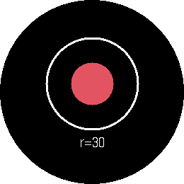 | 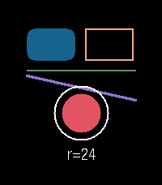 |

---

## Widgets

### Badge — `runtime/badge`

A reactive count badge: a filled disc with a centered number. Composes `Canvas`,
so `count` (a thunk or number) repaints for free.

```tsx
import { Badge } from "runtime/badge";
<Badge count={() => unread()} size={64} color="#e01818" />
```

| round | rect |
|---|---|
| 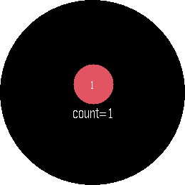 | 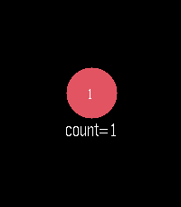 |

### ProgressBar — `runtime/progressbar`

A horizontal progress bar (rounded track + fill), `value` in `0..1`.

```tsx
import { ProgressBar } from "runtime/progressbar";
<ProgressBar value={() => pct()} width={180} height={16} />
```

| round | rect |
|---|---|
| 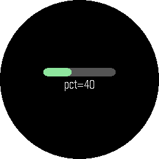 | 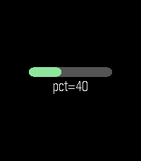 |

### Slider — `runtime/slider`

A track + thumb that displays a value in `[min,max]` (the app drives it).

```tsx
import { Slider } from "runtime/slider";
<Slider value={() => v()} min={0} max={1} width={180} />
```

The thumb is a disc half the SMALLER of `width`/`height`, so on a canvas
narrower than it is tall it fills the width and stops travelling rather than
painting past the track ends.

| round | rect |
|---|---|
| 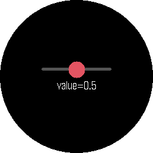 | 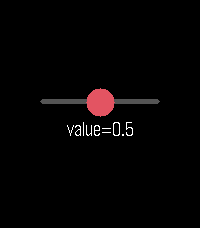 |

### Toggle — `runtime/toggle`

An on/off pill with a sliding knob.

```tsx
import { Toggle } from "runtime/toggle";
<Toggle on={() => enabled()} width={56} height={30} />
```

| round | rect |
|---|---|
| 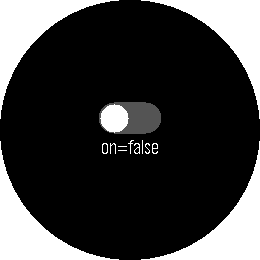 | 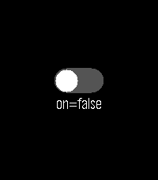 |

### Meter — `runtime/meter`

A segmented linear meter (battery/signal-style bars), `value` in `0..1`.

```tsx
import { Meter } from "runtime/meter";
<Meter value={() => level()} segments={6} width={180} height={22} />
```

| round | rect |
|---|---|
| 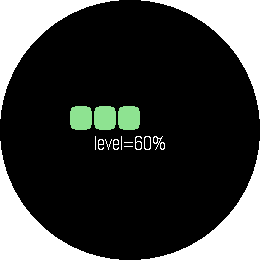 | 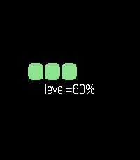 |

### Sparkline — `runtime/sparkline`

A mini line chart from an array of numbers.

```tsx
import { Sparkline } from "runtime/sparkline";
<Sparkline data={() => samples()} width={190} height={80} />
```

| round | rect |
|---|---|
| 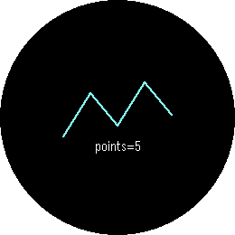 | 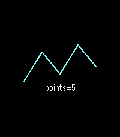 |

### DotIndicator — `runtime/dots`

Page/step dots, the active one highlighted.

```tsx
import { DotIndicator } from "runtime/dots";
<DotIndicator count={5} active={() => page()} width={150} />
```

| round | rect |
|---|---|
|  |  |

### Gauge — `runtime/gauge`

A circular value dial (arc sweep + optional centered label). Composes `Canvas` +
the `arc` primitive.

```tsx
import { Gauge } from "runtime/gauge";
<Gauge value={() => v()} label={(x) => Math.round(x * 100) + "%"} />
```

| round | rect |
|---|---|
| 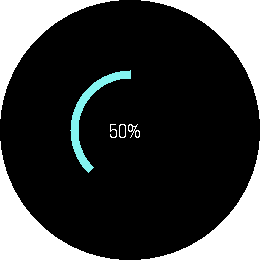 | 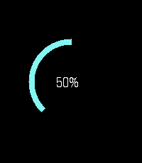 |

### ClockFace — `runtime/clockface`

An analog clock face — 12 ticks + hour/minute/second hands.

```tsx
import { ClockFace } from "runtime/clockface";
<ClockFace hours={() => h()} minutes={() => m()} seconds={() => s()} />
```

| round | rect |
|---|---|
| 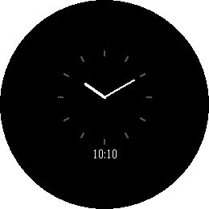 | 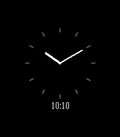 |

---

## UI kit

### StatusBar — `runtime/statusbar`

A top strip: title left, time right (thunks auto-track). On a round watch, wrap
it in a `RoundSafeArea` — a bare top strip sits under the bezel.

```tsx
import { StatusBar } from "runtime/statusbar";
<StatusBar title="Inbox" time={() => clock()} background="#303030" />
```

| round | rect |
|---|---|
| 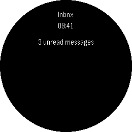 | 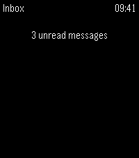 |

### ActionBar — `runtime/actionbar`

Pebble's right-edge button-hint strip (up / select / down).

```tsx
import { ActionBar } from "runtime/actionbar";
<ActionBar up="+" select="OK" down="-" background="#303030" />
```

| round | rect |
|---|---|
| 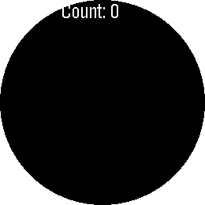 | 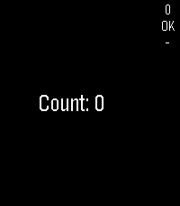 |

### Card — `runtime/card`

A titled, fill-skinned content box (bold title + body children).

```tsx
import { Card } from "runtime/card";
<Card title="Weather" width={190}><Label string="Sunny 72°F" /></Card>
```

| round | rect |
|---|---|
| 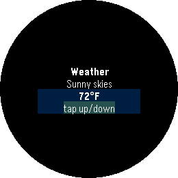 | 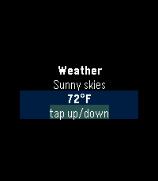 |

### Dialog — `runtime/dialog`

A centered title/message/hint modal card. The **message wraps** — it is split
into one `Label` per line by hand, because a width alone does not make a Piu
Label multiline on this port (the same reason `TextFlow` exists). Six lines max;
a reactive `message` thunk re-wraps in place.

```tsx
import { Dialog } from "runtime/dialog";
<Dialog title="Alert" message="Battery low" hint="SELECT ok" />
```

| round | rect |
|---|---|
| 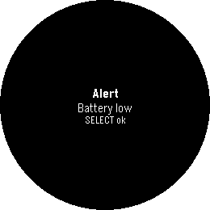 | 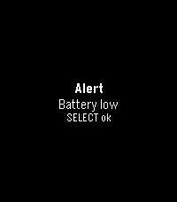 |

### Tabs — `runtime/tabs`

A horizontal tab bar, the active cell highlighted (the app owns the index).

```tsx
import { Tabs } from "runtime/tabs";
<Tabs labels={["Home", "Stats", "Set"]} active={() => tab()} activeFill="#1a4d4d" />
```

| round | rect |
|---|---|
| 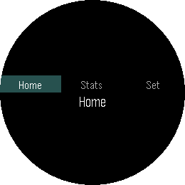 | 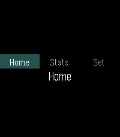 |

### RoundSafeArea — `runtime/roundsafe`

Insets its children to the round-screen safe area (pass-through on a rectangular
screen), so edge content isn't clipped by a round watch's bezel.

```tsx
import { RoundSafeArea } from "runtime/roundsafe";
<RoundSafeArea inset={18}><StatusBar title="Inbox" time={clock} /></RoundSafeArea>
```

| round | rect |
|---|---|
|  |  |

---

## Data

### useLocalStorage — `runtime/localstorage`

A `useState`-shaped reactive **string** cell persisted to the host `localStorage`
(webstorage over `device.keyValue`); degrades to an in-memory signal on a host
without webstorage.

```tsx
import { useLocalStorage } from "runtime/localstorage";
const [name, setName] = useLocalStorage("name", "world");
<Label string={() => "hi " + name()} />
```

| round | rect |
|---|---|
|  |  |

### useKVStorage — `runtime/kvstore`

The **structured** sibling of `useLocalStorage`: a reactive JSON-persisted store
for objects/arrays/numbers (corrupt/legacy values fall back to `initial`).

```tsx
import { useKVStorage } from "runtime/kvstore";
const [prefs, setPrefs] = useKVStorage("prefs", { count: 0 });
<Label string={() => "count " + prefs().count} />
```

| round | rect |
|---|---|
| 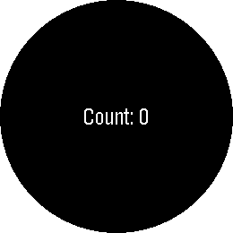 | 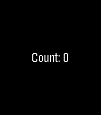 |

---

## Utilities

### easing — `runtime/easing`

Penner-style timing curves for `animate()`/tweens — `linear`, `quadIn/Out/InOut`,
`cubic*`, `sine*`, `expoOut`, `backOut`, `bounceOut`. Pure functions
(`[0,1]→[0,1]`, exact 0/1 endpoints), no Piu. The shot animates a box with
`backOut`.

```tsx
import { animate } from "runtime/flow";
import { backOut } from "runtime/easing";
const x = animate(0, 100, 800, backOut);
```

| round | rect |
|---|---|
| 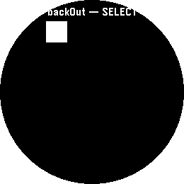 | 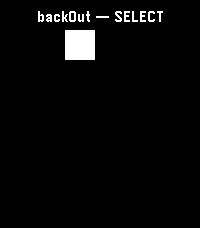 |

---

## Menus, input & lists

### Menu — `runtime/menu`

A vertical **scrolling, selectable** list (react-pebble MenuLayer analog). A clip
viewport over a Column of rows; the active row is highlighted and kept in view by
shifting the Column with `moveBy` (the proven Move idiom). Display-only — the app
owns `selected` and drives it with buttons.

```tsx
import { Menu } from "runtime/menu";
<Menu items={["Alarms", "Timers", "Stopwatch"]} selected={() => sel()} />
```

| round | rect |
|---|---|
| 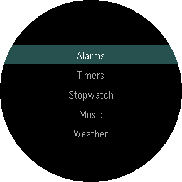 | 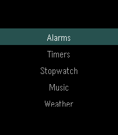 |

### Picker — `runtime/picker`

A value **carousel**: the current option centered and bold, its neighbors faded
above and below (a 3-row window). Optional `wrap` for a circular list.

```tsx
import { Picker } from "runtime/picker";
<Picker options={["Mango", "Apple", "Banana"]} selected={() => i()} wrap />
```

| round | rect |
|---|---|
| 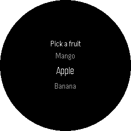 | 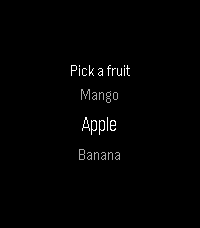 |

### NumberField — `runtime/numberfield`

A big-number **stepper** display (Pebble NumberWindow analog): the value centered
with `+`/`−` affordance hints and an optional unit suffix. The app owns the value.

```tsx
import { NumberField } from "runtime/numberfield";
<NumberField value={() => pct()} unit="%" min={0} max={100} />
```

| round | rect |
|---|---|
| 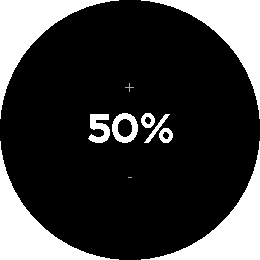 |  |

### TextFlow — `runtime/textflow`

**Wrapped** multi-line paragraph text — manual word-wrap into a Column of Label
lines (Piu `Text` isn't used; Labels are the device-proven substrate). Reactive
`text` re-wraps. **`shape="circle"`** wraps each line to the round screen's chord
at its height, so the paragraph FILLS the circle as a lens (short top/bottom
lines, long middle) instead of a centered square that wastes the corners.

```tsx
import { TextFlow } from "runtime/textflow";
<TextFlow text="Signal Piu wraps this text into a column of label lines." />
<TextFlow text={() => body()} shape="circle" />   // fill the round screen
<TextFlow text={() => body()} height={60} />      // reserve less than maxLines
```

⚠️ A **reactive** `text` box takes a FIXED height at construction — `height` if
you pass one, else `maxLines * lineHeight`. Piu position and size are
construction-time state (the runtime rejects reactive `height` on every other
component for that reason), so the re-wrap cannot resize a mounted box. A bare
string still shrinks to its own wrap.

| round | rect |
|---|---|
|  |  |

### ActionMenu — `runtime/actionmenu`

A modal **action sheet** (Pebble ActionMenu analog): a filled backdrop, a bold
title, and a Column of actions with the active one highlighted.

```tsx
import { ActionMenu } from "runtime/actionmenu";
<ActionMenu title="Message" actions={["Reply", "Archive", "Delete"]} active={() => a()} />
```

| round | rect |
|---|---|
| 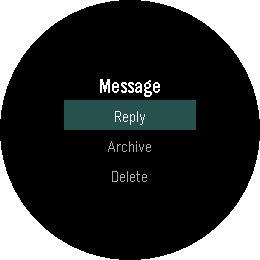 | 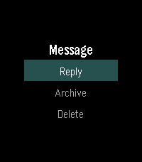 |

---

## Loading & animation

### Spinner — `runtime/spinner`

An animated indeterminate **loading indicator** (RN ActivityIndicator analog):
composes a `Canvas` + the `arc` primitive with an owned `angle` signal driven by a
~30fps `setInterval`. `running` (thunk) starts/stops it; the timer is cleared on
owner dispose.

```tsx
import { Spinner } from "runtime/spinner";
<Spinner size={48} running={() => loading()} />
```

| round | rect |
|---|---|
| 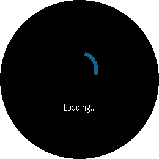 | 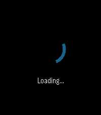 |

---

## Hooks — timers, state & animation

Pure reactive logic on top of signals; no Piu nodes. Each cleans up (timers,
subscriptions) on owner dispose via `onCleanup`. Timers use `setInterval` only
(no `setTimeout` on device). Hook demos render the hook driving a `Label` — shown
on gabbro, since a hook's output is shape-independent.

### timers — `runtime/timers`

`useInterval(cb, delay)` / `useTimeout(cb, delay)` — reactive timer hooks. A thunk
`delay` re-arms the timer; `null` pauses. Both return a manual `cancel()`.

```tsx
import { useInterval } from "runtime/timers";
useInterval(() => setCount((c) => c + 1), () => (paused() ? null : 1000));
```

| round | rect |
|---|---|
| 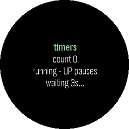 | 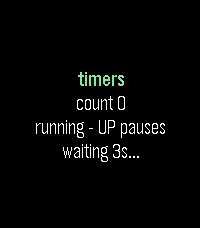 |

### hosttime — `runtime/hosttime`

`ticks()` / `elapsed(start, end?)` — MONOTONIC ms since boot (`Time.ticks`), for
timing work that `Date.now()` cannot measure (wall time jumps when the phone
resyncs it). Always subtract with `elapsed`, never by hand: the host hands ticks
back through an INT32, so a raw difference breaks once uptime passes ~24.9 days.
`useHostTimer(cb, delay)` → `{ reschedule, pause, cancel }` — one repeating host
timer you RE-AIM instead of rebuilding. Reach for it only when the delay changes
often (backoff, an accelerating countdown); `useInterval` stays the default.

```tsx
import { elapsed, ticks, useHostTimer } from "runtime/hosttime";
const t = useHostTimer(poll, 1000);
t.reschedule(5000);   // same host record — no clear+create, no allocation
```

_Source-proven: `time` and `timer` are in the Pebble DEVICE manifest's `modules`
**and** `preload`. No on-watch receipt yet — `APP=timeprobe node build.mts`. Device-receipted 2026-07-29: `screenshots/timeprobe-gabbro.png` (reschedule + pause live on gabbro)._

### state — `runtime/state`

`useToggle`, `useCounter` (bounded, `inc/dec/reset/set`), and `useDebounce`
(follows a source but settles only after it's stable).

```tsx
import { useCounter } from "runtime/state";
const [count, c] = useCounter(0, { min: 0, max: 10 });
```

_Node-100%-covered; builds + boots on device — demo: `pnpm run dev -- --app state`._

### useTween / useSequence / useSpring — `runtime/anim`

Motion hooks over the shared ~30fps ticker. `useTween` eases toward a **reactive
target** (RN `withTiming`) — composes `animate`, retargeting mid-flight from the
current value. `useSequence(steps, opts)` chains keyframes (moves + holds, optionally
looping — RN `withSequence`); the pure combinators `withDelay`/`withRepeat`/`yoyo`
compose into it. `useSpring(target, opts)` is physics-based motion (RN `withSpring`).
Each `useSequence`/`useSpring` owns one interval, cleaned up on dispose.

```tsx
import { useSequence, useSpring, yoyo } from "runtime/anim";
const x = useSequence(yoyo([{ to: 110, ms: 700 }]), { loop: true }); // bounce
const y = useSpring(() => open() ? 100 : 0, { stiffness: 180 });     // springy
```

Edges worth knowing: an explicit `ms: 0` (or negative) is a ZERO-duration
keyframe — an instant jump, not the 300 ms default, which only applies when `ms`
is omitted. A `yoyo` returns to the sequence's own `from`, so
`useSequence(yoyo([{ to: 100 }]), { from: 50 })` ends back at 50. `useSpring`
clamps a non-positive or non-finite `mass`/`precision` to its default — either
would leave the integrator unable to settle and its interval running forever.

| round | rect |
|---|---|
| 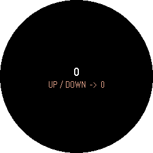 | 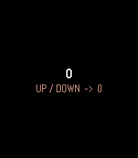 |

_`useSequence`/`useSpring` Node-100%-covered; build + boot — demo: `pnpm run dev -- --app sequence`._

---

## Hooks — time & device

### useClock — `runtime/clock`

A reactive current-time `Date` getter over the **native watch tick service**
(`secondchange`/`minutechange`) — one shared, wall-clock-aligned firmware timer,
better than a drifting `setInterval`. `useTimeParts()` splits it into per-field
getters.

```tsx
import { useClock } from "runtime/clock";
const now = useClock();
<Label string={() => now().toTimeString().slice(0, 8)} />
```

_Node-100%-covered; builds + boots on device — demo: `pnpm run dev -- --app clockhook`._

### watchInfo — `runtime/watchinfo`

`watchInfo()` — a one-shot snapshot of `model`, `firmware`, `hour12`, plus the
screen bounds (`width`/`height`/`round`/`color`). `useDisplayBounds()` returns just
the screen subset.

```tsx
import { watchInfo } from "runtime/watchinfo";
const info = watchInfo();  // { model, firmware, width, height, round, color, hour12 }
```

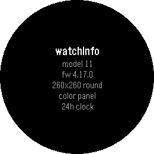

---

## Hooks — connectivity

### useMessage — `runtime/message`

A reactive **AppMessage** channel (watch ⇄ pkjs ⇄ phone) over `pebble/message`.
`last()` is the reactive inbound map; `send(obj)` writes outbound (outbox-full is
swallowed). `useAppMessage(keys, handler)` is the callback form.

```tsx
import { useMessage } from "runtime/message";
const { last, send } = useMessage(["cmd"]);
```


### useConfig — `runtime/config`

Clay **settings** as a reactive, persisted object: merges the config page's
payload (via pkjs `showConfiguration`) into a `useKVStorage` cell.

```tsx
import { useConfig } from "runtime/config";
const cfg = useConfig({ text: "hi", invert: 0 });
<Label string={() => cfg().text} />
```


### useFetch — `runtime/fetch`

Reactive HTTP fetch composed over the shipped `createResource` — a `{ data,
loading, error, refetch }` `Resource<T>`. **Device-gated:** watch-side `fetch`
proxies through the phone and its `Response` allocations OOM the 32KB arena from a
signal-runtime app (gotcha 18a) — keep a `useFetch` app lean, or prefer
fetch-over-message (XHR pkjs-side → string AppMessage → `createResource`).

```tsx
import { useFetch } from "runtime/fetch";
const res = useFetch<{ value: string }>("https://api.example.com/thing.json");
<Label string={() => (res.loading() ? "…" : String(res.data()?.value))} />
```

_Node-100%-covered; device-gated (gotcha 18a) — demo: `pnpm run dev -- --app fetch`._

---

## Hooks — sensors

Each wraps a single-instance Pebble host sensor (`embedded:sensor/*` or the bare
`watch` global) as a module-level singleton with refcount cleanup; `onSample` /
event callbacks write a signal. Drive live values under QEMU with the `pebble
emu-*` commands noted below.

### useAccel — `runtime/accel`

`useAccel()` → `{ x, y, z }` accelerometer readings (raw milli-g). `useTap()` →
the last tap direction (`"x+"` … `"z-"`). Drive: `pebble emu-accel gravity+x`,
`pebble emu-tap --direction x+`.

```tsx
import { useAccel } from "runtime/accel";
const a = useAccel({ hz: 25 });
<Label string={() => `x ${a().x}`} />
```

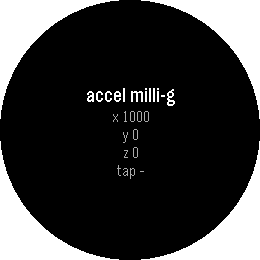

### useCompass — `runtime/compass`

`useCompass()` → the magnetic heading in **degrees** (0–360, CCW from north). A
`filter` throttles updates. Drive: `pebble emu-compass --heading 90`.

```tsx
import { useCompass } from "runtime/compass";
const heading = useCompass({ filter: 2 });
```

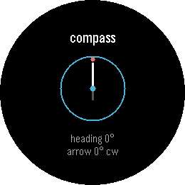

### useBattery — `runtime/battery`

`useBattery()` → `{ percent, charging, plugged }` (specifier
`embedded:sensor/Battery`). Drive: `pebble emu-battery --percent 25 --charging`.

```tsx
import { useBattery } from "runtime/battery";
const bat = useBattery();
<Label string={() => `${bat().percent}%`} />
```

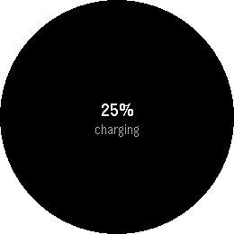

### useConnection — `runtime/connection`

`useConnection()` → `{ app, pebblekit }` bluetooth/phone connection state (the bare
`watch.connected` + its `connected` event). Drive: `pebble emu-bt-connection
--connected no`.

```tsx
import { useConnection } from "runtime/connection";
const conn = useConnection();
<Label string={() => (conn().app ? "Connected" : "Disconnected")} />
```

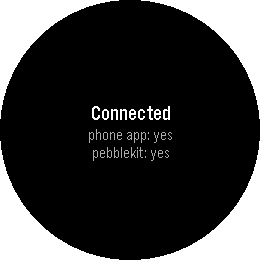

---

## Hooks — lifecycle

`useLaunchReason()` (why the app launched — a one-shot `{ reason, arguments }`),
`useAppFocus()` (a reactive focus getter), and `useWakeup()`
(`schedule`/`query`/`cancel` + a reactive `last` wakeup event) over the bare
`watch` global and `pebble/wakeup`. **Device-gated:** `didFocus`/`wakeup` are
event-driven and need a real device (or a scheduled wakeup) to fire — the hooks
are Node-verified and build+boot, but QEMU may not emit those events.

```tsx
import { useLaunchReason, useAppFocus } from "runtime/lifecycle";
const focused = useAppFocus();
<Label string={() => (focused() ? "focused" : "background")} />
```

_Node-100%-covered; device-gated (focus/wakeup events) — demo: `pnpm run dev -- --app lifecycle`._

---

## Media

Bitmap and vector images as reactive components — formalizing the hand-built
`Texture`/`SVGImage` idioms every watchface previously rolled by hand. The
`.png`/`.pdc` resource is derived from the `src` string **literal** at build time
(gen-manifest scans the app source), so passing a literal ships the asset
automatically. All substrate here is device-proven (`sloth`/`imgwatch`/`slothvec`).

### Image — `runtime/image`

A single bitmap on one Piu Content (RN `<Image>` analog): `new Texture(src)` (the
`.png` suffix is **mandatory** — gotcha 19) framed by a texture Skin. An optional
`variants` (per-frame width) + reactive `variant` turns it into a sprite filmstrip
that animates by ONE integer write (a whitelisted reactive prop).

```tsx
import { Image } from "runtime/image";
<Image src="logo.png" width={64} height={64} />
```


### ImageBackground — `runtime/imagebackground`

Children composited **over** a bitmap (RN `<ImageBackground>` analog): a texture Skin
is the Container's background and `children` mount on top — the watchface "art +
clock" pattern. Distinct from `Image` (a lone leaf) and `Card` (a flat fill).

```tsx
import { ImageBackground } from "runtime/imagebackground";
<ImageBackground src="bg.png" width={120} height={120}><Label string={() => t()} /></ImageBackground>
```


### VectorImage — `runtime/vectorimage`

A resolution-independent **PDC vector** on one `SVGImage` node — free scaling, zero
pixel RAM. It hides the four hard SVGImage rules (transforms applied post-mount via
an `onDisplaying` hook; `center` required; forced `scale(1,1)` so it draws at all;
`rotate` absolute), turning the multi-hour slothvec saga into one component.
`scale`/`rotate` are reactive; a driving effect re-applies them (idiom 5b).

```tsx
import { VectorImage } from "runtime/vectorimage";
<VectorImage src="icon.pdc" width={120} height={120} center={[30, 7]} translate={[30, 7]} scale={() => s()} />
```


---

## Input

Button-driven interaction over the jsx-runtime focus/press substrate
(`onPress*`/`onRelease*` events reach the **focused** node; pair with the `focus`
prop). Touch is deliberately unused — gotcha 2: a real-coordinate touch reboots the
emulator, and most Pebbles have no digitizer. Drive on QEMU with `pebble emu-button`.

### Button — `runtime/button`

A focusable Container+Label with a pressed-skin swap (RN Button/Pressable +
react-pebble `useButton`): owns a `pressed` signal wired to `onPressSelect`/
`onReleaseSelect`, fires `onPress` on release, optional `onLongPress`. One focused
Button per screen (or manage focus yourself).

```tsx
import { Button } from "runtime/button";
<Button label="OK" onPress={() => fire()} />
```


_Drive the press with `pebble emu-button select`._

### press — `runtime/press`

Three press-timing hooks that return handler **bags** to spread on a focused node:
`useLongPress(button, ms, onFire)` (hold-to-fire), `useRepeatClick(button, onFire,
opts)` (press-and-hold auto-repeat, accelerating), `useMultiClick(button, handlers,
opts)` (double/triple click). All share the `setInterval` timing substrate and clean
up on dispose.

```tsx
import { useLongPress } from "runtime/press";
<Container focus {...useLongPress("Select", 600, () => confirm())} />
```

_Node-100%-covered; builds; the focus/press substrate is device-proven (see Button) — demo: `pnpm run dev -- --app press`._

### useBackHandler — `runtime/backhandler`

Intercept the **Back** button (RN `BackHandler`): returns `{ onPressBack }` to spread
on a focused node; the handler returns `true` to consume Back (stay in-app, e.g. pop
a Navigator) or `false` to allow exit. **Device caveat:** the in-app intercept is
proven; whether consuming Back prevents the *firmware* app-exit is unverified under
QEMU (a guaranteed override needs `pebble/button` — see device-gated below).

```tsx
import { useBackHandler } from "runtime/backhandler";
<Container focus {...useBackHandler(() => nav.canPop() ? (nav.pop(), true) : false)} />
```

_Node-100%-covered; builds; the `onPressBack` substrate is device-proven (see Button) — demo: `pnpm run dev -- --app backhandler`._

---

## Layout & lists

### Scrollable — `runtime/scrollable`

Free-form scroll of arbitrary-height content (RN `ScrollView` + Pebble
`ContentIndicator`) — the one foundational primitive the catalog lacked (`Menu` is
selectable rows, `VirtualList` recycles). A clip viewport over a Column scrolled by
`offset` via `moveBy` (the proven Menu idiom); with `indicator`, up/down chevrons in
reserved, non-overlapping `Label` gutters (`"^"` / `"v"`) that flip as the offset
crosses the ends. Pass `max` (content − viewport) so the down chevron is correct from
the first frame. `ContentIndicator` is also exported standalone. NB: the chevrons are
`Label`s, NOT a draw `Canvas` overlay — a Canvas Port over (or a second chevron Canvas
beside) the `moveBy`'d Column wedges the firmware (gotcha 24, MEASURED on gabbro).

```tsx
import { Scrollable } from "runtime/scrollable";
<Scrollable height={140} offset={() => y()} max={84} indicator>{tallColumn}</Scrollable>
```


_Device-verified on gabbro (scrolled to offset 56 — content advanced and BOTH chevrons show; `"v"`-only at the top, `"^"`-only at the max). Node-100%-covered; typecheck + biome clean._

### Grid — `runtime/grid`

An N-column tile layout (RN `FlatList numColumns`): a Column of Rows built from
`items` via a `cell(item, index)` render prop — app launchers, icon pickers, keypads.
Static structure (drive a changing set with `<For>`/`VirtualList` over the rows).

```tsx
import { Grid } from "runtime/grid";
<Grid columns={3} items={icons} cell={(it, i) => <Image src={it.png} width={40} height={40} />} />
```

`columns` is clamped to at least 1 — a `0` from config would otherwise loop
forever and a negative would allocate Rows until the arena died.


### SectionList — `runtime/sectionlist`

Grouped headers + rows in one recycled window (RN `<SectionList>`): headers and
rows share a flat index space (headers non-selectable), `selected` is kept in
view, and each visible slot is ONE reused Label whose caption/style/skin derive
from the window position — no flattened record array, no `VirtualList`
composition. `renderHeader`/`renderRow` return **string** captions.

```tsx
import { SectionList } from "runtime/sectionlist";
<SectionList sections={() => groups()} renderHeader={(h) => h} renderRow={(r) => r.name} selected={() => i()} />
```

_Device-verified on gabbro AND emery (2026-07-28) after the standalone
rewrite — the first on-device render in the component's history. The old composed-over-
VirtualList build was arena-BUDGET death (review-findings D3/D4): the flatten
allocated a parallel record array AND pulled `runtime/flow` into the archive.
The rewrite derives each cell from `sections` + an int `start[]` offsets array,
which also lets treeshake drop `flow` from the app entirely (symbols 149→140,
archive −2326 B) — that headroom is the whole fix. Keep-in-view + boundary-
crossing selection (headers skipped) are device-proven with button drives._


---

## Hooks — output

### useHaptics — `runtime/vibration`

The vibration motor (RN `Vibration` + react-pebble `useVibration`) — the biggest
missing OUTPUT channel: `useHaptics()` → `{ short, long, double, pattern, cancel }`
over the static `pebble/vibes` class. `pattern([on, off, …])` takes alternating ms
segments; the motor is cancelled on owner dispose — but only when the pattern
still playing is one THIS hook started, so a disappearing child never silences a
long alert its still-mounted parent fired. An explicit `cancel()` is
unconditional.

```tsx
import { useHaptics } from "runtime/vibration";
const h = useHaptics();
<Button label="OK" onPress={() => { save(); h.short(); }} />
```


_The physical buzz is **not** observable on QEMU (no motor / `emu-vibe`) — felt only on real hardware._

---

## Not feasible from watch JS today

The exhaustive Piu/Pebble API survey (against the on-disk Moddable/Pebble host)
classified the remaining RN/Pebble surface. These families are **intentionally not
shipped** — no watch-side JS surface reaches them from a mod:

- **`useHealth`** (steps / activity / heart rate) — the HealthService lives only
  in the Pebble **C** SDK; Moddable ships no health JS module or typing. The QEMU
  emulator can inject values (`pebble emu-steps` …) but there is nothing on the JS
  side to observe them. Needs a new native/host module upstream.
- **`useLight`** (ambient light) — there is **no live light service anywhere**,
  even in C (only a per-minute historical `AmbientLightLevel` buried in the Health
  API); no `emu-light` command. Treat ambient light as unavailable. (`watch.light()`
  controls the **backlight**, an output — not an ambient sensor.)
- **`QRCode`** — the "not present in the built device tree" claim above was
  **REFUTED on-device (hostprobe, gabbro 2026-07-29)**: `xs_qrcode` strings exist
  in the firmware image, `importNow("qrcode")` resolves to an object AND the
  `QRCode` Piu content global is a function (`screenshots/hostprobe-gabbro.png`).
  So the encoder + content node ARE reachable from a JS mod. Still unshipped as a
  component: the remaining gate is a RENDER probe (props/arena cost of an actual
  on-screen code) — moved from "infeasible without a probe" to "present,
  render-binding pending".
- **Sound / audio** — no watch-side JS audio surface and no speaker (only the
  vibration motor); `piu/Sound` has no Pebble implementation. Route tones to
  `useHaptics`.
- **Touch gestures** (swipe / drag / pan / pull-to-refresh) — button-first platform;
  a real-coordinate touch reboots QEMU (gotcha 2) and most Pebbles have no digitizer.
  Steer all gesture UX to buttons.
- **`Die` clip / `Wipe`&`Comb` transitions**, **native `AnimatedImage`/APNG**,
  **`Shape`** — not Pebble globals (absent from `piuPebble.js` / the Pebble Piu
  manifest). The feasible substitutes: rectangular clip via a container `clip`,
  reactive-`variant` sprites (see `Image`), and vector art via `VectorImage`.
- **`useContentSize`**, **`useAppGlance`**, **`useTimelinePin`**, **`useQuietTime` /
  `useNotification`**, **`useTouch`** — no Moddable JS getter/binding exists (C-SDK,
  phone/pkjs, or dead surface); the emulator can *set* some but nothing on the JS side
  observes them.
- **RN system APIs** — `useColorScheme`, `Clipboard`, `Share`, `Linking`/`openURL`,
  `Keyboard`, `AccessibilityInfo`, `PixelRatio`: no Pebble surface (use `useDictation`
  or the char-picker for text input; `openURL` is pkjs-config-only).

## Device-gated (probe-pending)

Reachable in principle (the host surface exists) but **not yet device-verified**, so
not shipped this round — each needs a healthy emulator or a real watch to confirm. In
rough priority: **`useUnobstructedArea`** (Quick-View resize; watchface-only),
**animated Navigator transitions** (base `Transition` + `moveBy`; ~2× arena overlap),
**`useLocation`** (GPS via pkjs; no QEMU fix), **`useDictation`** (probe-proven UI, no
transcript without mic+phone), **`usePhysicalButtons`** (focus-free buttons +
guaranteed Back-override via `pebble/button`), **`useWebSocket`** (phone-tunnelled,
arena pressure), the **Pebble-only native content nodes** (`RoundRect`, `Inverter` —
globalThis'd but never exercised; erratum 2026-07-29: `RichText`/`NinePatch`,
previously listed here, do NOT exist anywhere in this SDK tree — removed), a
**native content-clock animator**, and **`ScreenBuffer`**.

## Hostprobe discoveries (gabbro receipt, 2026-07-29)

A one-screen probe app (`src/tsx/examples/hostprobe.tsx`,
`screenshots/hostprobe-gabbro.png` — build with `TREESHAKE_FORCE=1`, its dynamic
`importNow` strings are host modules the static scan can't follow) settled the
bind-coverage audit's uncatalogued host surface:

- **`setTimeout`/`clearTimeout` EXIST and WORK** (`typeof function`, callback
  FIRED) — the old "no setTimeout on device" claim is corrected across
  timers/press/button; implementations stay on the proven setInterval shape.
- **Bound this round:** `watch.light` → `backlight()` and `watch.exit` →
  `exitApp()` (runtime/watchinfo), `device.info.language`/`serialNumber` →
  `watchInfo()` fields (serial is `undefined` on QEMU — coerced to `""`),
  `"hour"`/`"day"` tick granularities → `useClock` (host `hourchange`/
  `daychange`, subscribe-proven).
- **Follow-through (2026-07-29, same day — all device-receipted):**
  - `device.files` → **BOUND** as `runtime/files` (`readFile`/`writeFile`/
    `deleteFile`/`listFiles` over the app-private PFS dir; writeFile
    deletes-then-recreates because NOR writes may only CLEAR bits — verified:
    `fileprobe` shows `roundtrip-ok / rewrite: ok / list: 1`,
    `screenshots/fileprobe-gabbro.png`).
  - `QRCode` → **RENDERS on device** (`qrprobe`: a real code with quiet zone
    from `new QRCode(null, {string})` — the Piu content IS in the mod
    compartment; `screenshots/qrprobe-gabbro.png`). The JSX wrapper SHIPPED
    same day: **`QR` — `runtime/qrcode`** (`string` static or thunk — a thunk
    drives ONE effect writing `node.string`, the host re-encodes in place;
    `size` default 124; `fullscreen`). **The round-fullscreen answer,
    device-proven both ways:** a QR is a SQUARE with finder patterns in three
    corners, so a naive screen-sized square on the round panel loses all four
    corners to the bezel and stops scanning
    (`screenshots/qrclip-gabbro.png` — the deliberate counter-receipt);
    `fullscreen` therefore means the LARGEST INSCRIBED SQUARE
    (`floor(260/√2)` = 183 px on gabbro, centered — fully visible,
    `screenshots/qrfull-gabbro.png`). Caveat in the JSDoc: at 183 px the
    quiet zone is only ~4 px (~0.6 module) — drop to `size={124}` for a
    spec-wide white border if a strict scanner balks.
  - `piu/Timeline` → **tweens on device** (`tlprobe`: label x 16→197 across
    distinct frames via `Timeline.to` + a setInterval `seekTo` driver;
    `screenshots/tlprobe-gabbro.png`; verdict on replacing runtime/anim is in
    the example header — build with `TREESHAKE_FORCE=1`, the dynamic host
    import disables the static scan).
  - `willFocus` → **BOUND** as `useAppFocus("will")` (phase param mirrors
    useClock's granularity idiom; subscribe device-proven, DELIVERY remains
    emulator-uncertain like didFocus — the module says so).
  - `time`/`timer` → **BOUND** as `runtime/hosttime` (`ticks`/`elapsed`/
    `useHostTimer`). Sourced verdict: both ARE device-shipped —
    `build/devices/pebble/manifest.json` lists `base/time/*`, `base/time/
    pebble/*`, `base/timer/*`, `base/timer/pebble/*` under `modules` and names
    `time` + `timer` in `preload`, so they cost the mod manifest nothing. Only
    the members PebbleOS implements are bound: `Time.set`/`timezone`/`dst` are
    all `xsUnknownError("unimplemented")` in `modTime.c`. The value over the
    globals (which ARE this Timer — main.js sets `setInterval = Timer.repeat`,
    `setTimeout = Timer.set`, `clearInterval = Timer.clear`) is the two
    operations they omit: `Timer.schedule` re-aims a LIVE timer with no
    free/malloc, and `schedule(id)` pauses without destroying it.
    DEVICE-RECEIPTED (`timeprobe`, gabbro 2026-07-29): ticks 7996 at boot,
    up strictly growing (63779ms), the self-reschedule flipped fires to
    gap 250 ("250ms (rescheduled)"), and UP froze fires at 328 across two
    frames while `up` kept counting ("paused") —
    `screenshots/timeprobe-gabbro.png`.
  - The market unlock demonstrated: `weather` — a weather FACE fed over the
    device-proven config channel (`--` fallback until data, then a driven
    payload renders city/temp/condition + live clock;
    `screenshots/weather-fallback-gabbro.png`, `weather-gabbro.png`; the
    phone-side FETCH stays a documented pkjs edit).

---

## Note on a single all-in-one gallery

An on-watch "browse every component from one menu" app is **not** shippable as a
single mod: each component module's symbols intern at boot, and ~19 of them
overflow the firmware's boot-symbol floor (measured: `fxAbort memory full`).
Lazy screens defer *code instantiation* (arena) but not *symbol interning* (boot
floor), and this firmware has no true separate-archive module loading (upstream
ask #5). So the per-component example apps above **are** the per-feature demos —
each boots on its own and is what these screenshots capture. A future on-watch
gallery would need per-component sub-archives or a firmware symbol-budget lift.
