# Examples gallery

55 example apps, every one buildable with `APP=<name> node build.mts` (or
`pnpm run dev -- --app <name>` for build+install+logs). This gallery shows
the ones with committed screenshot receipts, grouped by what they teach; the
rest are measurement probes listed at the end. gabbro = 260×260 round,
emery = 200×228 rect — same source, `screen.*` adapts.

## The flagship

**`pulse`** — every proven mechanism in one polished face: custom-TTF serif
clock, fine-grained date/seconds, persisted themes, config-page greeting,
pulsing accent dot, lazy post-boot init. It shipped only after dying into
the boot budgets twice — [the lessons](xs-heap-playbook.md) are part of it.

| gabbro | theme change | emery |
|---|---|---|
| 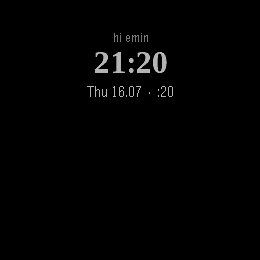 | 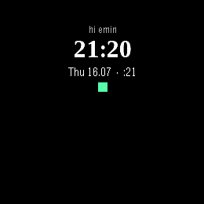 | 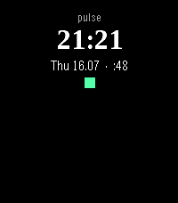 |

## Watchfaces

| app | teaches | receipt |
|---|---|---|
| `ultraface` | Apple-Ultra "Modular Ultra", **re-interpreted natively for the round screen** — a 60-segment RADIAL seconds ring (elapsed / current-accent / future, stepping clockwise from 12), dense instrument complications pushed to the rim, big HH:MM + numeric seconds, all on one `useClock("second")` draw Canvas. A boot-floor lesson too: inline geometry (no retained array) + one Style per font keep it inside the 32KB arena | 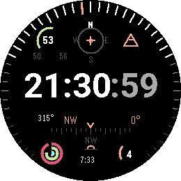 |
| `watchface` | ticking clock, same-value dedupe (the tutorial face) | 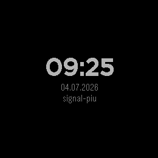 |
| `sloth` 🦥 | sprite-sheet blink animation, one Texture | 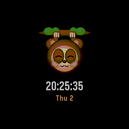 |
| `slothvec` 🦥 | PDC vectors via SVGImage — scaling + transform animation, zero pixel RAM | 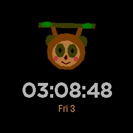 |
| `slothface` | text-frame animation | 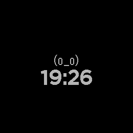 |
| `imgwatch` | color bitmaps (png2bmp) + frame-swap animation | 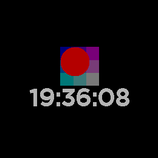 |
| `fontface` | custom TTF via the fonts/ convention | 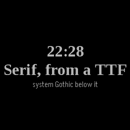 |
| `clock` | Date + setInterval + Bitham/Gothic styles | 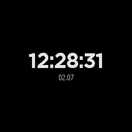 |

## Reactivity & state

| app | teaches | receipt |
|---|---|---|
| `counter` | useState + buttons, the hello-world |  |
| `toggle` | reactive `skin`/`style` swap | 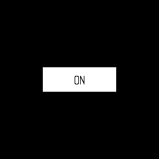 |
| `autothunk` | bare `string={"c"+count()}` — the build's auto-thunk | 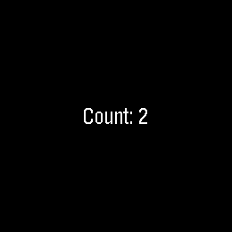 |
| `hooks` | the full hooks surface in one app | 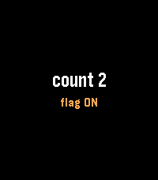 |
| `forbind` | reactive bindings inside `For` rows | 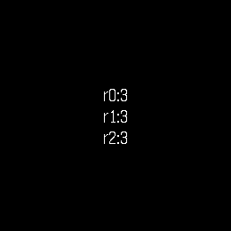 |

## Lists & data

| app | teaches | receipt |
|---|---|---|
| `list` | byte store + windowing + PERSISTED records | 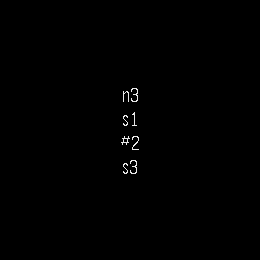 |
| `scroll` | `VirtualList` — recycled cells, unbounded list on 32KB | 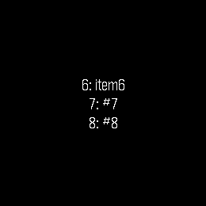 |
| `richlist` | `renderRow` subtree rows (and their measured ceiling) | 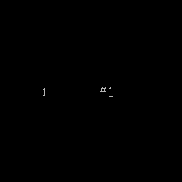 |
| `forbind5vl` | 5 LIVE reactive rows via recycling (raw For dies here) | 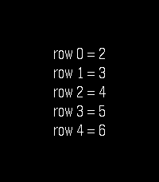 |
| `kvprobe` | `device.keyValue` persists across relaunch | 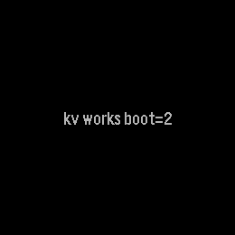 |

## Navigation & screens

| app | teaches | receipt |
|---|---|---|
| `navmany` | 100 screens, RAM-flat (`Navigator` = O(1 screen)) | 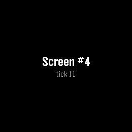 |
| `navreactive` | reactive screen under Navigator — the 384-slot stack canary | 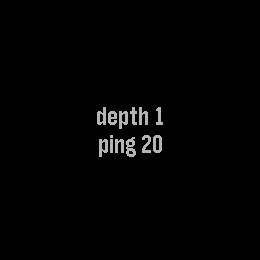 |
| `loadms` | cold `importNow` of a lazy module: **2ms** measured | 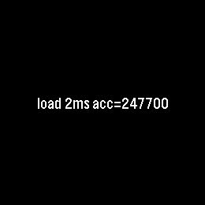 |
| `rootapp` | the typesafe root-component entry (no hand-written render) | 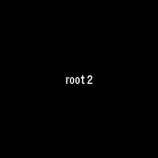 |

## Position & motion

| app | teaches | receipt |
|---|---|---|
| `movebox` | `<Move>` reactive position + `animate()` tween | 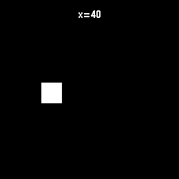 |

## Phone & host integration

| app | teaches | receipt |
|---|---|---|
| `config` | settings-page round-trip (the Clay flow), headlessly drivable | 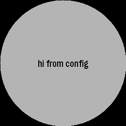 |
| `devlog` | visible release-firmware logging via the pkjs bridge |  |
| `deviceinfo` | everything the host reports (size/round/color/clock) | 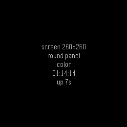 |
| `dictate` | dictation probe — the system UI opens; transcription needs hardware | 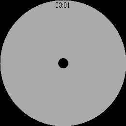 |

## Probes & measurement apps (no screenshots — their receipts are numbers)

`anim` `autoscreens` `boundary` `coexist` `component` `crashdemo` `fetchtest`
`lazyauto` `lazyfat` `lazyklass` `lazymany` `lazyone` `lazypack` `lazyscreen`
`manyfx` `multifile` `multilazy` `multiscreen` `navdrill` `navfat` `port`
`romscreens` `romtable` `slotbench` `slotbenchp` `textinput` `watchms` — each
exists to measure or prove one platform fact; the findings live in
[field-notes](field-notes.md) and [the playbook](xs-heap-playbook.md).
(`multiscreen` is kept as a deliberate DOES-NOT-BOOT artifact.)
